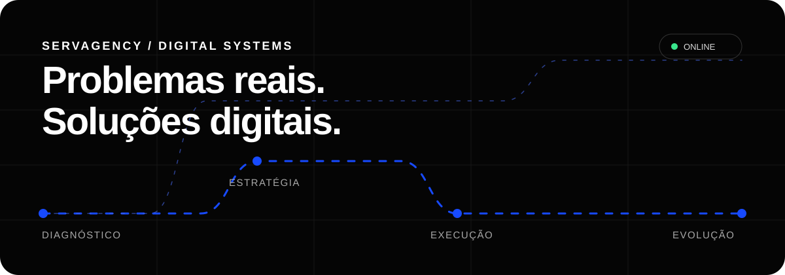
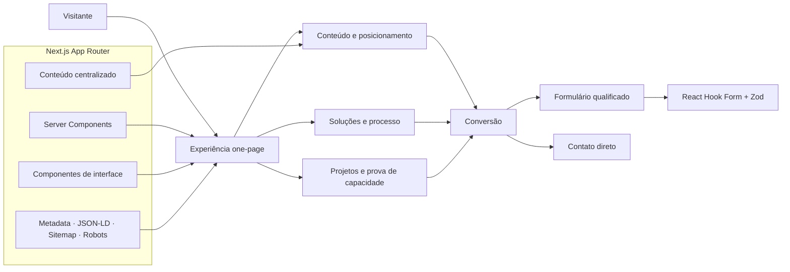

<div align="center">

<a href="https://servagency.vercel.app">
  
</a>

<br />

[](https://servagency.vercel.app)
[](https://nextjs.org/)
[](https://www.typescriptlang.org/)
[](https://vercel.com/)

### Tecnologia, design e estratégia para resolver problemas reais de empresas.

[Conhecer o projeto](https://servagency.vercel.app) · [Explorar soluções](https://servagency.vercel.app/#solucoes) · [Falar sobre um projeto](https://servagency.vercel.app/#contato) · [Ler a fundação](./docs/PROJECT_FOUNDATION_AGENCIA_TECNOLOGIA.md)

</div>

---

## O que é a ServAgency

A **ServAgency** é uma agência de tecnologia e soluções digitais criada para ajudar pequenas e médias empresas a construir presença, transmitir confiança e operar melhor.

O projeto ocupa o espaço entre uma agência digital, um estúdio de desenvolvimento e uma consultoria de tecnologia. Em vez de começar por uma ferramenta ou por um pacote genérico, começa pela compreensão do negócio: identifica gargalos, define prioridades e implementa a solução proporcional ao problema.

> Não entregamos apenas páginas, posts ou código. Construímos clareza, credibilidade, descoberta e eficiência.

### O produto

O website é, ao mesmo tempo:

- a presença institucional da ServAgency;
- um canal de aquisição e qualificação de oportunidades;
- uma demonstração prática da qualidade que a agência entrega;
- uma plataforma preparada para evoluir com cases, conteúdo, serviços e integrações.

Sua primeira versão é uma **one-page institucional de alta profundidade**: objetiva como uma landing page, abrangente como um site institucional e orientada a uma conversão clara — iniciar uma conversa sobre um problema real.

## Por que este projeto existe

Muitos negócios vivem uma presença digital fragmentada: o site não representa a qualidade do serviço, o Google está incompleto, as redes não conversam entre si e processos repetitivos continuam manuais. A ServAgency reduz essa fragmentação conectando quatro disciplinas em uma única direção.

| Pilar                | Como atuamos                      | Valor gerado                                   |
| :------------------- | :-------------------------------- | :--------------------------------------------- |
| **Estratégia**       | Diagnóstico antes da execução     | Prioridades claras e investimento consciente   |
| **Tecnologia**       | Web, integrações, automações e IA | Processos mais rápidos e soluções sustentáveis |
| **Presença digital** | Marca, conteúdo, Google e SEO     | Mais clareza, confiança e descoberta           |
| **Evolução**         | Medição, manutenção e melhoria    | Estrutura preparada para crescer               |

## Filosofia

```text
problema → diagnóstico → direção → implementação → medição → evolução
```

Princípios que orientam produto, conteúdo e engenharia:

1. **O problema vem antes da ferramenta.** Tecnologia é meio, nunca argumento vazio.
2. **A solução deve ser proporcional.** Nem complexidade desnecessária, nem entrega superficial.
3. **Benefícios antes de termos técnicos.** O cliente precisa entender o valor sem dominar o stack.
4. **Qualidade é um sistema.** Visual, conteúdo, acessibilidade, performance e SEO trabalham juntos.
5. **Honestidade comercial.** Sem métricas inventadas, promessas garantidas ou autoridade artificial.
6. **Evolução contínua.** O lançamento é uma base mensurável, não o fim do produto.

## Soluções

<table>
  <tr>
    <td width="50%"><strong>01 · Websites e experiências digitais</strong><br />Sites institucionais, landing pages, campanhas, UX/UI, reformulações e soluções web sob demanda.</td>
    <td width="50%"><strong>02 · Presença digital e marketing</strong><br />Posicionamento, comunicação, organização de canais, conteúdo inicial e estrutura de marca.</td>
  </tr>
  <tr>
    <td><strong>03 · Google e SEO</strong><br />SEO técnico e local, consistência de informações e otimização para descoberta.</td>
    <td><strong>04 · Auditoria digital</strong><br />Análise de presença, experiência, performance, conversão e prioridades de melhoria.</td>
  </tr>
  <tr>
    <td><strong>05 · Automações e inteligência artificial</strong><br />Integrações, organização de leads, assistentes e redução de trabalho repetitivo.</td>
    <td><strong>06 · Soluções sob demanda</strong><br />Sistemas internos, dashboards, ferramentas operacionais e consultoria técnica.</td>
  </tr>
</table>

## Arquitetura do produto



### Decisões arquiteturais

- **App Router e Server Components por padrão:** menos JavaScript no cliente e conteúdo rastreável.
- **Client Components somente onde há interação:** menu, FAQ e formulário permanecem isolados.
- **Conteúdo separado da apresentação:** textos, serviços, projetos e perguntas vivem em uma camada centralizada.
- **Componentes orientados a seção:** cada bloco possui responsabilidade visual e semântica clara.
- **SEO como parte da arquitetura:** metadata, canonical, Open Graph, JSON-LD, sitemap e robots nascem com o produto.
- **Deploy contínuo:** a branch `main` publica automaticamente na Vercel; branches e PRs recebem previews.

## Estrutura do repositório

```text
ServAgency/
├── docs/                         # Fundação estratégica e PRD
├── public/
│   ├── favicon.svg               # Identidade da aplicação
│   └── readme-hero.svg           # Hero animado deste README
├── src/
│   ├── app/                      # App Router, SEO e estilos globais
│   ├── components/
│   │   ├── layout/               # Header e footer
│   │   ├── sections/             # Seções da narrativa comercial
│   │   └── ui/                   # Primitivos visuais reutilizáveis
│   ├── content/                  # Conteúdo estruturado do site
│   └── lib/                      # Schema e utilidades
├── .env.example                  # Contrato de variáveis de ambiente
├── next.config.ts
└── package.json
```

## Stack

| Camada         | Tecnologia                                       | Responsabilidade                           |
| :------------- | :----------------------------------------------- | :----------------------------------------- |
| Framework      | [Next.js 16](https://nextjs.org/)                | Renderização, rotas, metadata e otimização |
| Interface      | [React 19](https://react.dev/)                   | Composição e interações                    |
| Linguagem      | [TypeScript](https://www.typescriptlang.org/)    | Segurança de tipos e manutenção            |
| Estilos        | [Tailwind CSS 4](https://tailwindcss.com/) + CSS | Sistema visual responsivo                  |
| Formulário     | [React Hook Form](https://react-hook-form.com/)  | Estado e experiência do formulário         |
| Validação      | [Zod](https://zod.dev/)                          | Contrato e mensagens de validação          |
| Ícones         | [Lucide](https://lucide.dev/)                    | Iconografia consistente                    |
| Qualidade      | ESLint + Prettier                                | Padronização e prevenção de regressões     |
| Infraestrutura | [Vercel](https://vercel.com/)                    | Build, CDN, previews e produção            |

## Direção visual

O sistema visual traduz a ideia de **tecnologia precisa, humana e em movimento**.

- branco real e preto para clareza editorial;
- azul cobalto como sinal de ação, conexão e tecnologia;
- tipografia Geist expressiva, com hierarquia forte;
- rotas e nós como metáfora do caminho entre problema e solução;
- movimento discreto, funcional e compatível com `prefers-reduced-motion`;
- grid modular, alto contraste e ausência de efeitos decorativos genéricos.

## Qualidade como requisito

O projeto foi construído com metas explícitas:

- HTML semântico e navegação por teclado;
- skip link, foco visível, labels e feedbacks compreensíveis;
- responsividade de 320px a telas amplas, sem scroll horizontal;
- TypeScript em modo estrito;
- conteúdo rastreável e estrutura de headings coerente;
- canonical, sitemap, robots, manifest e dados estruturados;
- build otimizado, dependências controladas e pouco JavaScript no cliente.

### Pipeline local de qualidade

```bash
npm run format:check
npm run lint
npm run typecheck
npm run build
```

## Executando localmente

Pré-requisitos: **Node.js 22+** e **npm**.

```bash
git clone https://github.com/oluisvi/ServAgency.git
cd ServAgency
npm install
cp .env.example .env.local
npm run dev
```

A aplicação estará em [http://localhost:3000](http://localhost:3000).

### Variáveis de ambiente

| Variável                      | Uso                                                |
| :---------------------------- | :------------------------------------------------- |
| `NEXT_PUBLIC_SITE_URL`        | URL canônica usada por metadata, sitemap e JSON-LD |
| `NEXT_PUBLIC_WHATSAPP_NUMBER` | Canal oficial de contato                           |
| `NEXT_PUBLIC_CONTACT_EMAIL`   | E-mail público da agência                          |

## Deploy

Produção: **[servagency.vercel.app](https://servagency.vercel.app)**

O repositório está conectado à Vercel:

```text
push em main ──→ build ──→ validação ──→ produção
pull request ──→ build ──→ preview isolado
```

## Roadmap

- [x] Fundação estratégica e PRD
- [x] Identidade ServAgency
- [x] Website institucional responsivo
- [x] SEO técnico e dados estruturados
- [x] Formulário com validação acessível
- [x] Deploy contínuo na Vercel
- [ ] Conectar envio transacional do formulário
- [ ] Preencher e-mail oficial e dados dos fundadores
- [ ] Publicar projetos e estudos de caso reais
- [x] Adicionar política de privacidade inicial
- [x] Configurar analytics, performance e eventos de conversão
- [ ] Futuro: conectar domínio próprio e Search Console

## Compromissos

Este projeto não inventa clientes, resultados, depoimentos, números ou parcerias. Informações comerciais ainda não definidas permanecem identificadas como pendências até serem substituídas por dados reais.

Para conhecer todas as decisões de estratégia, UX, conteúdo, SEO, acessibilidade e performance, consulte a [fundação completa do projeto](./docs/PROJECT_FOUNDATION_AGENCIA_TECNOLOGIA.md).

---

<div align="center">

**ServAgency** · Estratégia, tecnologia e execução no mesmo lugar.

[Website](https://servagency.vercel.app) · [Soluções](https://servagency.vercel.app/#solucoes) · [Contato](https://servagency.vercel.app/#contato) · [GitHub](https://github.com/oluisvi/ServAgency)

<sub>Todos os direitos reservados à ServAgency.</sub>

</div>
